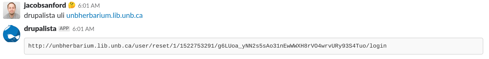

# Drupalista
## Introduction
Interact with CargoDock deployed Kubernetes hosted Drupal containers via Slack.



## Required environment variables

 * ```SLACK_TOKEN``` : The slack token used to connect drupalista to your slack instance.
 * ```KUBE_NODE``` : The IP or hostname of the kubernetes API node.
 * ```KUBE_NODE_PORT``` : The port of the kubernetes node to use for API access.
 * ```KUBE_NODE_CA_KEY``` : The admin CA to assert to the kube client API.
 * ```KUBE_CLUSTER_ID``` : The cluster ID to use for context.
 * ```KUBE_SERVICE_ACCOUNT``` : The service account to use when accessing the cluster
 * ```KUBE_BEARER_TOKEN``` : The bearer token issued to the service account.

## Commands
 * ```list_sites``` : List instances controllable by Drupalista.
 * ```clear_cache``` : Rebuild the cache of a specific instance
 * ```uli``` : Provide a ULI link for the specified instance
 * ```hostfile``` : Deliver a hostfile to use for development purposes (if domains are not resolved to k8s cluster)

## License
 - Drupalista is licensed under the MIT License:
   - http://opensource.org/licenses/mit-license.html
 - Attribution is not required, but much appreciated:
   - `Drupalista by UNB Libraries`
